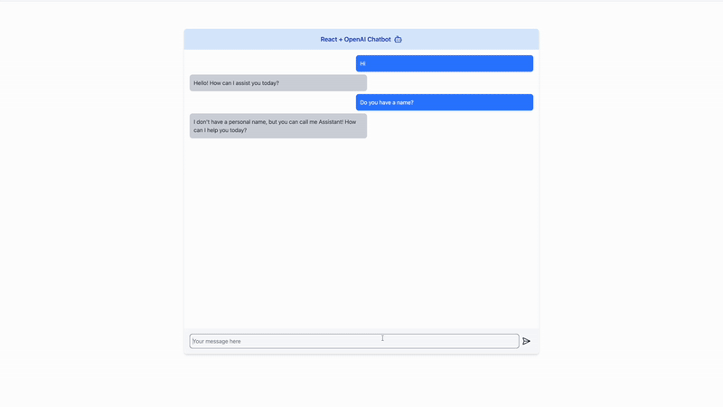

# AI Chatbot 🤖
Meet Assistant! A simple AI chatbot built using React + Vite and powered by ChatGPT-4. This project allows users to interact with an AI assistant in real-time.

🚀 Features
- ✅ Responsive chat interface
- ✅ AI-powered responses using OpenAI GPT-4 API
- ✅ Built with React and Vite for fast performance
- ✅ Lightweight and easy to customize

# Demo with Assistant 🤖
## Intro of ChatBot
.gif)

This is an introduction to the chatbot.

## Philippines Travel Itinerary with Assistant


Here is the Philippines travel itinerary demonstration.


## React Chat Component

User Inteface:
- Header: Displays the title React + OpenAI Chatbot along with a chatbot icon (LuBot) from the react-icons package.

```tsx
<h2 className="p-4 font-semibold text-lg text-center bg-blue-100 flex text-blue-800 justify-center items-center gap-2">
          React + OpenAI Chatbot <LuBot size={25} />
</h2>
```
- Chat Area: The chat messages are displayed in a scrollable area, which will automatically scroll to the latest message, thanks to the useChatScroll hook.

```tsx
const ref = useChatScroll(messages); 
```


- Input Area: Contains an input field for the user to type messages and a send button (LuSendHorizontal icon) to submit the message.

```tsx
<div className="flex items-center p-4 bg-gray-50">
  <input
    type="text"
    className="flex-1 p-2 border rounded-lg focus:outline-none"
    placeholder="Your message here"
    value={input}
    onChange={(e) => setInput(e.target.value)}
  />
  <button onClick={handleSend} className="p-2">
    <LuSendHorizontal size={25} />
  </button>
</div>
```

Hooks and State Management:
- useState: The input state is used to track what the user types into the input field.
- useChatbot: This custom hook is responsible for sending user messages to OpenAI’s GPT API and receiving bot responses.
- useChatScroll: This custom hook handles auto-scrolling the chat when new messages are added.

```tsx
const [input, setInput] = React.useState(""); 
const { messages, sendMessage } = useChatbot(); 
const ref = useChatScroll(messages); 

```
Rendering Messages:
- The messages array contains the chat history, which is mapped over to display each message.
- The Markdown component is used to render the text content of each message, allowing for markdown syntax (e.g., links, bold text) to be rendered properly.
- Messages from the user are styled with a blue background, while bot messages are displayed with a gray background.

```tsx
   {messages.map((msg, index) => (
          <div
            key={index}
            className={
                "p-3 rounded-lg max-w-lg " +
                (msg.sender === "user"
                  ? "bg-blue-500 text-white ml-auto"
                : "bg-gray-300 text-gray-800")    }
          >
              <Markdown>{msg.text}</Markdown>       
          </div>
    ))}
```
Sending Messages:
- The user types a message into the input field. When the send button (represented by a send icon) is clicked, the handleSend function is triggered.
- If the input is not empty, it adds the user's message to the messages array, then sends the message to the OpenAI API through the sendMessage function, and clears the input field.


```tsx
const handleSend = () => {
  if (input.trim()) {
    sendMessage(input); 
    setInput("");
  }
};
```

## Chatbot with OpenAI Integration
This React hook (`useChatbot`) manages the chat messages, sends user input to OpenAI's GPT-4 model, and updates the UI with responses.

```tsx
interface Message {
    text: string;
    sender: "user" | "bot";
}
const useChatbot = () => {
    const API_KEY = import.meta.env.VITE_OPENAI_API_KEY;
    if (!API_KEY) {
        throw new Error("Missing OPENAI_API_KEY in environment variables");
    }

    const [messages, setMessages] = useState<Message[]>([]);

    const sendMessage = async (message: string) => {
        const newMessages: Message[] = [
            ...messages,
            {text: message, sender: "user"},
        ];

        setMessages(newMessages);

    try {
            const response = await axios.post(
                "https://api.openai.com/v1/chat/completions",
                {
                    model: "gpt-4o-mini",
                    messages: [{
                        role: "user",
                        content: message,
                    }]
                },
                {
                    headers: {
                        Authorization: `Bearer ${API_KEY}`,
                        "Content-type": "application/json",
                    },
                }
            );
            const botMessage = response.data.choices[0].message.content;
            setMessages([...newMessages, {text: botMessage, sender: "bot"}]);
        } catch (error) {
            console.error("Error fetching AI response: ", error);
        }
    };

    return { messages, sendMessage };
};
```


Tool helped me debug from client side and see it in terminal instead of Chrome Dev Tool(Vite Plugin Terminal):
https://github.com/patak-dev/vite-plugin-terminal

